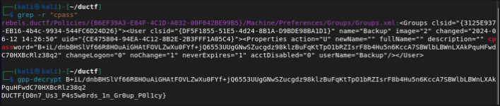

Bad Policies
============

After investigating the files it is easy to identify that these are Group Policy files.

Use Grep to find cpassword in the Group Policy

```grep -r "cpass"```

use gpp-decrypt on Kali or any other tool to crack the "hash"

```gpp-decrypt B+iL/dnbBHSlVf66R8HOuAiGHAtFOVLZwXu0FYf+jQ6553UUgGNwSZucgdz98klzBuFqKtTpO1bRZIsrF8b4Hu5n6KccA7SBWlbLBWnLXAkPquHFwdC70HXBcRlz38q2```



Flag is obtained DUCTF{D0n7_Us3_P4s5w0rds_1n_Gr0up_P0l1cy}