Macro Magic
============

This challenge was created by TurboPenguin and Pix during the Graveyard shift. Its got alot of memes with tons of fake flags and messages. Half the macro was also generated by AI and memed by TurboPenguin.

We can see in the challenge we are given two files. A Packet Capture "Capture.pcapng" and a Excel enabled Spreadsheet "Monke.xlsm"

When we open up the packet capture we can see there are a bunch of HTTP requests out to a bunch of websites.

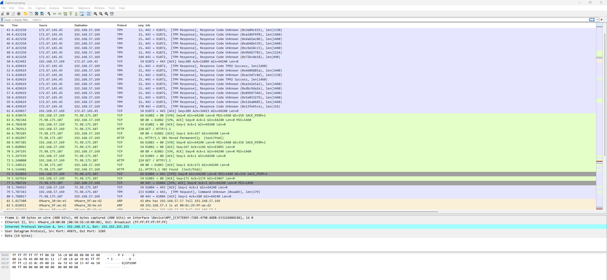

Clicking File -> Export Objects -> HTTP, We can see all the requests in the packet capture.

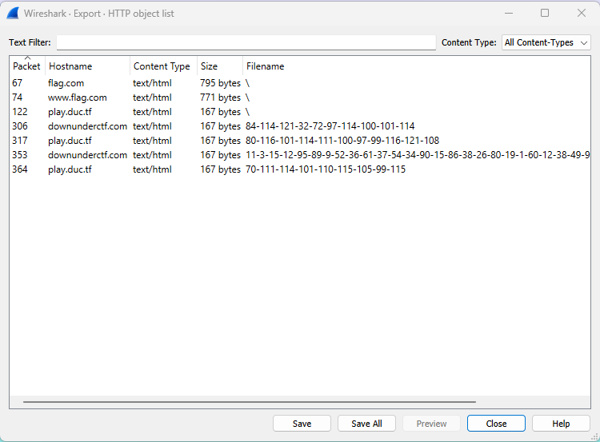

There are some strange file names. Looking into a few, some we are able to decipher with Cybercheff magic and are instantly memed on.

- `70-111-114-101-110-115-105-99-115`

- `11-3-15-12-95-89-9-52-36-61-37-54-34-90-15-86-38-26-80-19-1-60-12-38-49-9-28-38-0-81-9-2-80-52-28-19`

- `80-116-101-114-111-100-97-99-116-121-108`

- `84-114-121-32-72-97-114-100-101-114`

https://gchq.github.io/CyberChef/#recipe=Find_/_Replace(%7B'option':'Simple%20string','string':'-'%7D,',',true,false,true,false)From_Decimal('Comma',false)&input=ODAtMTE2LTEwMS0xMTQtMTExLTEwMC05Ny05OS0xMTYtMTIxLTEwOAo&oeol=FF

There is one string which just gives us random info. This is because its either modified or encrypted. We need to investigate the macro to see whats happening.

We open up the excel sheet to be memed again. This time with monkeys.

Luckily there is a nice tool out there called olevba which can pull the macros out of an excel spreadsheet. This is found in oletools and can be installed with `pip install -U oletools`

We run `olevba Monke.xlsm` to dump the macro.

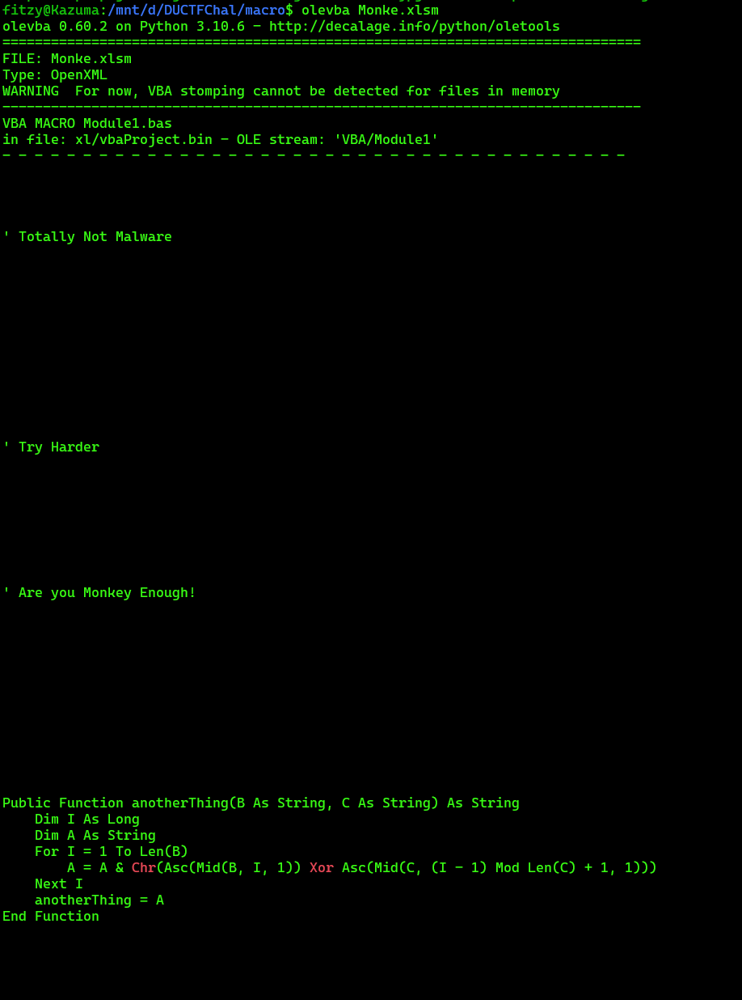

We can see that there are muiltiple functions filled with alot of messages.

Some look like potential flags. But we just get memed again.

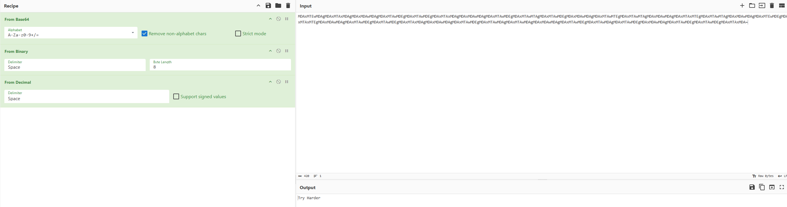

https://gchq.github.io/CyberChef/#recipe=From_Base64('A-Za-z0-9%2B/%3D',true,false)From_Binary('Space',8)From_Decimal('Space',false)&input=TURBeE1URXdNREFnTURBeE1UQXhNREFnTURBeE1EQXdNREFnTURBeE1UQXdNREVnTURBeE1UQXdNREVnTURBeE1UQXhNREFnTURBeE1EQXdNREFnTURBeE1UQXdNREVnTURBeE1UQXdNVEFnTURBeE1UQXdNREVnTURBeE1EQXdNREFnTURBeE1UQXdNVEVnTURBeE1UQXdNVEFnTURBeE1EQXdNREFnTURBeE1UQXhNVEVnTURBeE1UQXdNVEFnTURBeE1EQXdNREFnTURBeE1URXdNREVnTURBeE1UQXhNVEVnTURBeE1EQXdNREFnTURBeE1UQXdNREVnTURBeE1UQXdNREVnTURBeE1UQXhNREFnTURBeE1EQXdNREFnTURBeE1UQXdNREVnTURBeE1UQXdNREFnTURBeE1UQXdNREFnTURBeE1EQXdNREFnTURBeE1UQXdNREVnTURBeE1UQXdNREFnTURBeE1UQXdNREVnTURBeE1EQXdNREFnTURBeE1UQXdNREVnTURBeE1UQXdNREVnTURBeE1UQXhNREE9&oeol=FF

Looking at macro1() we can see this is the main macro where the smarts happen.

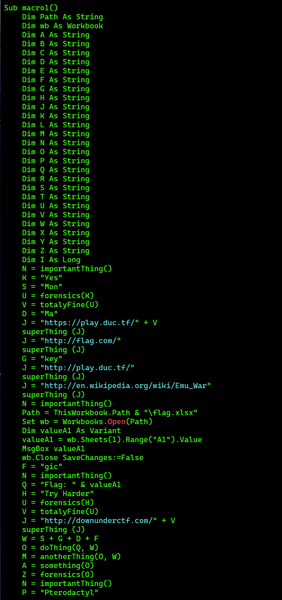

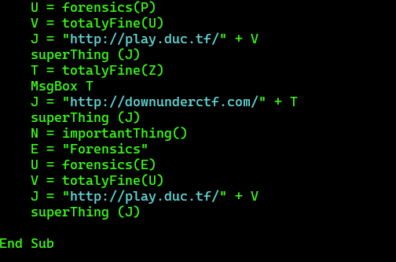

We can see it opens up another xlsx which is not provided called `flag.xlsx` and pulls `A1`. This must be what the content of the message is aka the flag. Looking at what happens after, we can see `valueA1` is put into `Q`. Ill up the rest of the steps into stages as it can get complicated.

1. `Q` is used in `doThing(Q, W)` to get O. 
2. `W` is `S + G + D + F` (Adding them together from the macro we get `MonkeyMagic`). 
3. Looking into the `doThing(Q, W)` function we can see its XORing the flag. 
4. `O` is used in `forensics(O)` to get `Z`. 
5. `forensics(O)` convers converts the string to decimal. 
6. `Z` is used in `totalyFine(Z)` to get `T`. 
7. `totalyFine(U)` removes the ` ` and adds a `-`. 
8. `T` is then used in the URL that is set in `J` (`J = "http://downunderctf.com/" + T`). 
9. The `superThing(J)` function sends the `GET` request.

The rest of the information is just dummy data or traffic generation.

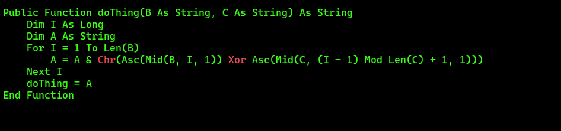

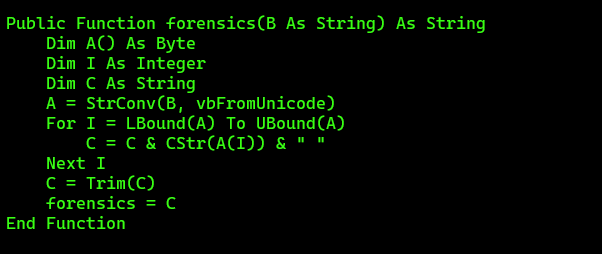

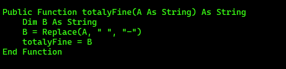

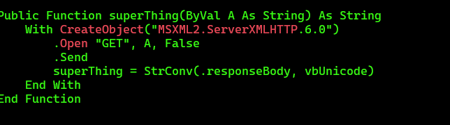

Using the information we pulled. We can now XOR decode the flag.

Flag: `DUCTF{M4d3_W1th_AI_by_M0nk3ys}`

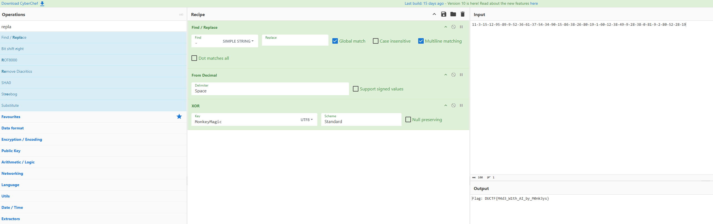

https://gchq.github.io/CyberChef/#recipe=Find_/_Replace(%7B'option':'Simple%20string','string':'-'%7D,'%20',true,false,true,false)From_Decimal('Space',false)XOR(%7B'option':'UTF8','string':'MonkeyMagic'%7D,'Standard',false)&input=MTEtMy0xNS0xMi05NS04OS05LTUyLTM2LTYxLTM3LTU0LTM0LTkwLTE1LTg2LTM4LTI2LTgwLTE5LTEtNjAtMTItMzgtNDktOS0yOC0zOC0wLTgxLTktMi04MC01Mi0yOC0xOQ&ieol=CRLF&oeol=FF