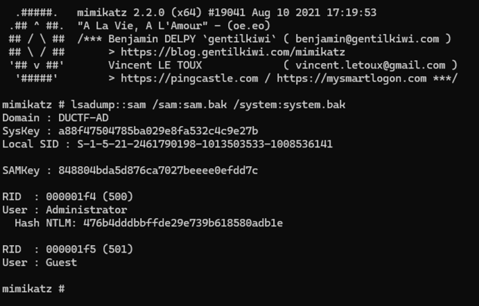
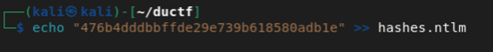
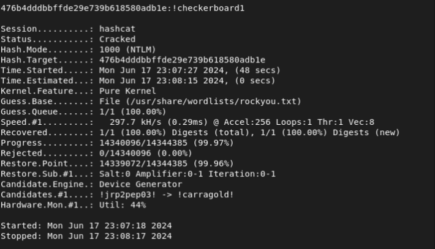

SAM I AM
============

Using Mimikatz, you can dump SAM passwords with a SAM and SYSTEM file which is dumped from registy.

```lsadump::sam /sam:sam.bak /system:system.bak```



The Administrator hash can be found as 476b4dddbbffde29e739b618580adb1e

If we push this to a file for hashcat to use we can crack it

```echo “476b4dddbbffde29e739b618580adb1e” >> hashes.ntlm```



Cracking the NTLM hash with hashcat

```hashcat -m 1000 hashes.ntlm /usr/share/wordlists/rockyou.txt --force```



Password is !checkerboard1


Flag is put together as DUCTF{!checkerboard1}