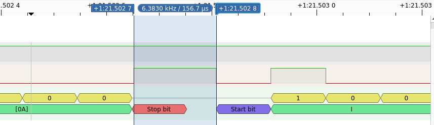

birdloader
============

Password comparison on the device is performed with `strcmp`, in between the output lines "Checking...\r\n" and "Incorrect PIN.".

Since the device is running on an 8-bit microcontroller, and is clocked at 8MHz (compared to the RP2040's 125MHz), and we are directly connected, we should be in a great position to observe a timing side-channel caused by this non-constant-time comparison.

A byte of UART data consisits of a Start Bit (0), 8 data bits (LSB first), and a Stop Bit (1). 

For the most precise measurement, we wish to measure the time from the start of "\n"'s Stop Bit to the start of "I"'s Start Bit:



This time is nominally 1s/9600 = 104μs, but can stretch indefinitely depending on how much computation is performed between byte transmissions.

Since the MSB of "\n" is 0, we will always have a rising edge at the start of the stop bit. 

The RP2040 allows us to configure interrupts for when a GPIO pin changes between high and low, and configure the SYSTICK timer peripheral to run at 125MHz. This allows us to record the time of each UART transition with great accuracy:

```c
void gpio_interrupt(uint gpio, uint32_t event_mask) {
	times[times_i++] = systick_hw->cvr;
}
```

To identify the right point, our solve script hardcodes the array `{1,2,1,2,3,1,1,2,1,1,1,1,2,4,1,2,1,1,1,4}`, which corresponds to the spans of time without a transition leading up to the end of "\n", in multiples of 104μs:

```
      .          .          \r         \n         I
   ________   ________   ________   ________   ________
  0011101001 0011101001 0101100001 0010100001 0100100101
                                            ^ ^
1 span: 1  1   3-- 1  1  1 2-    1   1 1    | |
0 span:  2-  2-   1 2-  1 1    4   2- 1 4---| |
                                            | End of time measured
                                            |
                                            Start of time measured
```

See [solve.c](solve.c) for a full implementation.
