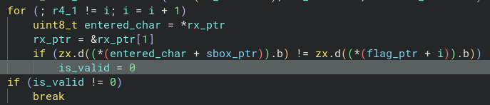
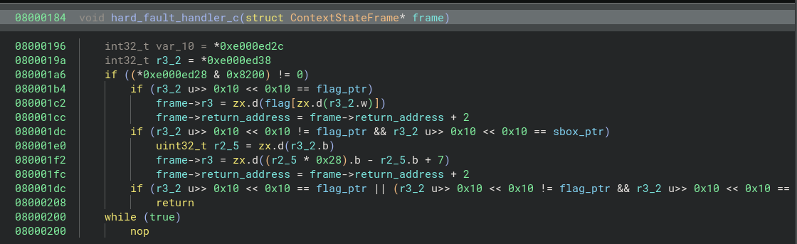

# Crash Landing

Reversing this, we find a standard UART read loop and a string compare:

It should be noted `sbox_ptr` and `flag_ptr` are `0xbeef0000` and `0xdead0000` respectively.
These addresses arent mapped on the processor used.

When the CPU tries to access these, a HardFault will be raised.

The hardfault handler has functionality to return from hardfaults, provided we read from one of the `sbox_ptr` or `flag_ptr` addresses.
Knowing this, we can identify the `sbox_ptr` as an affine cipher, with function `39x + 7`, and can then decode the flag stored in the data referred to by `flag_ptr`.
