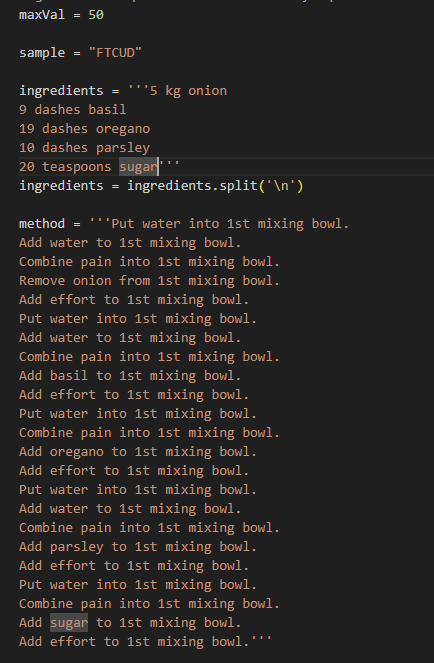
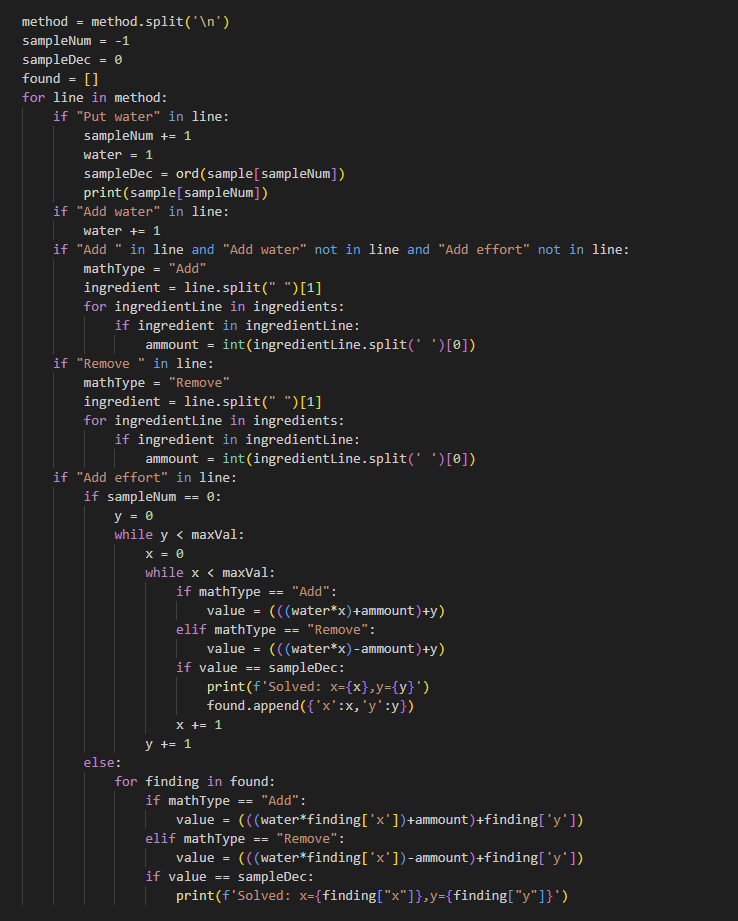
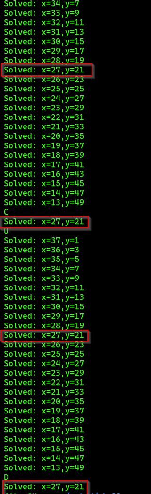
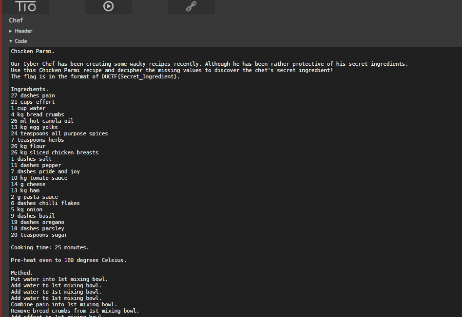
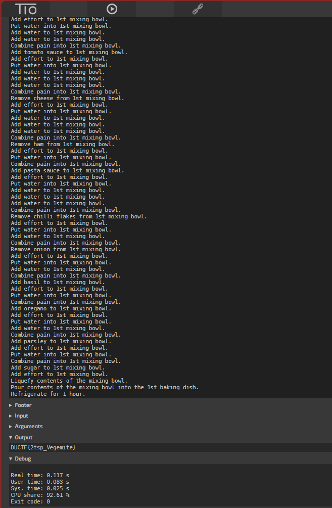

Wacky Recipe
============

Opening the recipe you can see its a bit strange. There are large values and the strange wording you know its not a normal recipe.

With enough research you can discover that this is an actuall coding language. By researching what Put, Combine, Add and Remove does we can figure out how each value is being calculated.

Liquefy is running at the end which convers decimal to asci.

https://www.dangermouse.net/esoteric/chef.html

- Put (This puts the ingredient into the nth mixing bowl.)

- Add (This adds the value of ingredient to the value of the ingredient on top of the nth mixing bowl and stores the result in the nth mixing bowl.)

- Remove (This subtracts the value of ingredient from the value of the ingredient on top of the nth mixing bowl and stores the result in the nth mixing bowl.)

- Combine (This multiplies the value of ingredient by the value of the ingredient on top of the nth mixing bowl and stores the result in the nth mixing bowl.)

- Liquefy (This turns the ingredient into a liquid, i.e. a Unicode character for output purposes. (Note: The original specification used the word "Liquify", which is a spelling error. "Liquify" is deprecated. Use "Liquefy" in all new code.))

We can see that Water is Put first which sets the value as 1. Water is then added which ads to the value. The value is then multiplied by pain, an ingredient is added and finaly effort is added.

By writing a script we can test all possible values between 1 and 50 for the pain and effort values. We pull all the values and calculate all equastions which will result in the decimal values of DUCTF. The language outputs in the oposite direction so the flag starts at the bottom of the recipe.

Once we finish and run the solve script we can see the values of pain and effort are 27 andy 21.

Solved: x=27,y=21

You can run the code in https://tio.run/#chef with the new values.

Final flag is DUCTF{2tsp_Vegemite}